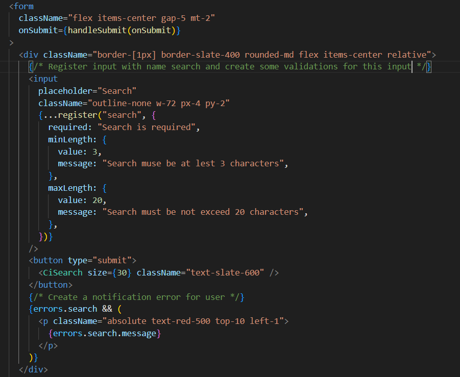

# react-hook-form

**In this exercise I have used redux and react-hook-form to manage state and value of input**

**Step1:** Create a store that include initial state and reducer

**Step2:** Using useDispatch and useSelector to get and set data input receive from react-hook-form

**Step3:** Register, validation input by using react-hook-form 

**Step4:** Check the result with bad data input:

